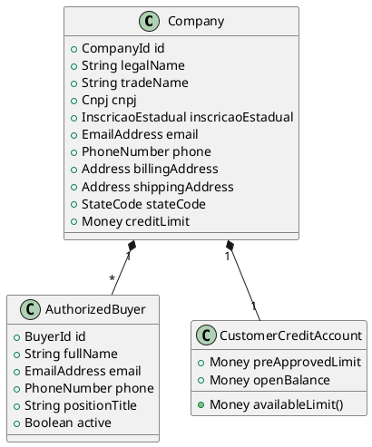
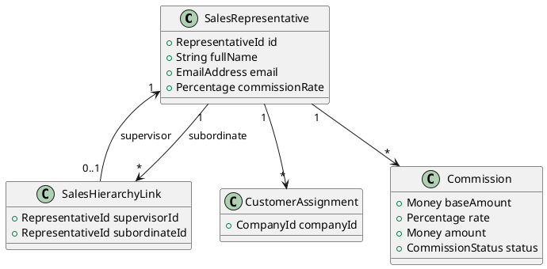
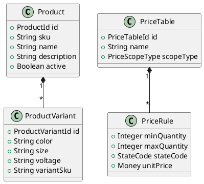
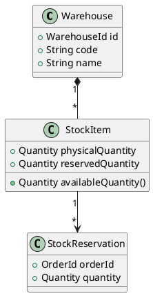
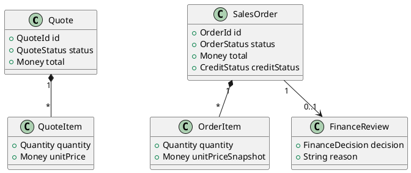
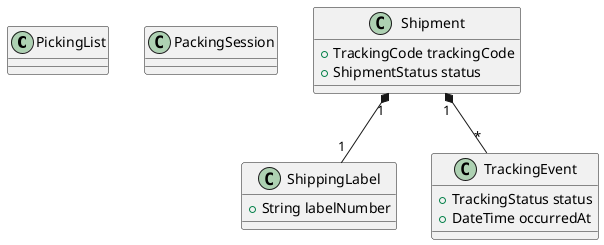
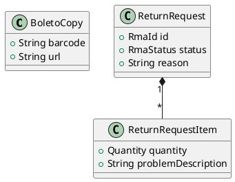
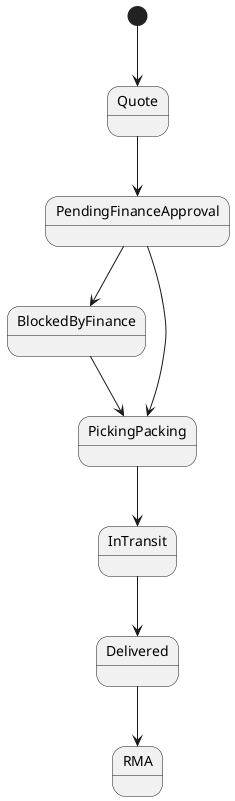

# Visão Geral dos Contextos

```text
┌──────────────────────┐
│ Customer Management  │
└──────────┬───────────┘
           │
           ▼
┌──────────────────────┐
│     Sales Team       │
└──────────┬───────────┘
           │
           ▼
┌──────────────────────┐
│       Catalog        │
└──────────┬───────────┘
           │
           ▼
┌──────────────────────┐
│      Inventory       │
└──────────┬───────────┘
           │
           ▼
┌──────────────────────┐
│      Order Flow      │
└──────────┬───────────┘
           │
           ▼
┌──────────────────────┐
│      Logistics       │
└──────────┬───────────┘
           │
           ▼
┌──────────────────────┐
│   Customer Portal    │
└──────────────────────┘
```

---

# Customer Management



---

# Sales Team



---

# Catalog

Aqui eu faria de Product um Aggregate Root.



---

# Inventory



---

# Order Flow

Esse é o coração do sistema.



---

# Logistics



---

# Customer Portal



---

# Diagrama mais importante: Aggregate Roots

Eu definiria os Aggregates assim:

```text
Company
├── AuthorizedBuyer
└── CustomerCreditAccount

SalesRepresentative
├── CustomerAssignment
├── Commission
└── SalesHierarchyLink

Product
└── ProductVariant

PriceTable
└── PriceRule

Warehouse
├── StockItem
└── StockReservation

Quote
└── QuoteItem

SalesOrder
├── OrderItem
└── FinanceReview

Shipment
├── ShippingLabel
└── TrackingEvent

ReturnRequest
└── ReturnRequestItem
```

---

# Serviços de domínio

```text
CreditPolicy
CommissionCalculator
InventoryAllocator
OrderPricingService
OrderStateMachine
FreightQuoteService
TrackingService
```

---

# Máquina de estados do pedido

Eu modelaria isso explicitamente:



---

# Melhoria aos requisitos

```text
shared_kernel
```

```text
shared_kernel
│
├── ids/
├── enums/
├── value_objects/
├── events/
├── specifications/
├── domain_services/
└── failures/
```

com:

```text
Money
Percentage
Quantity
Weight
Address
PhoneNumber
EmailAddress
ZipCode
StateCode
TrackingCode

OrderStatus
RmaStatus
ShipmentStatus
CreditStatus
FinanceDecision

DomainEvent
AggregateRoot
Entity
ValueObject
```
